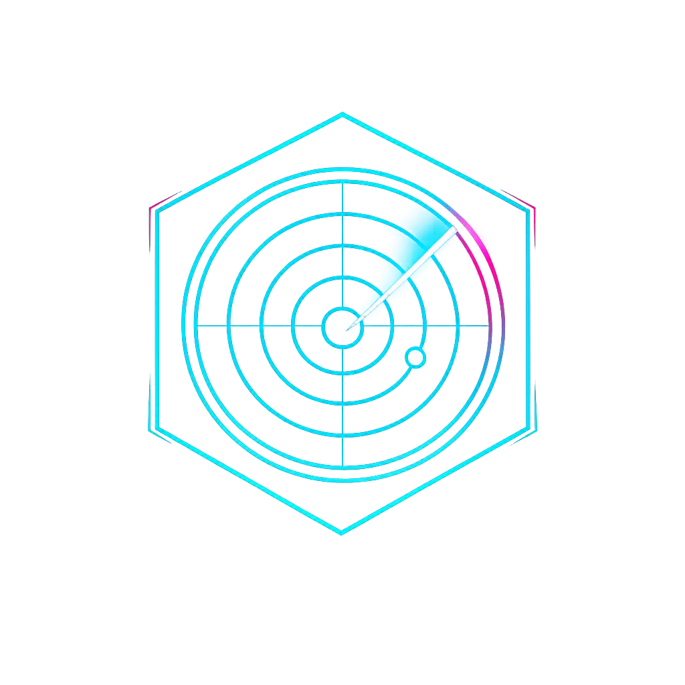

<div align="center">



# hot-monitor 2.0 · AI 热点雷达

**关键词级全网热点监控 —— 真实、相关、重要的热点才会推给你**

</div>

## 特性

- 🔭 **六源聚合采集**：Twitter / 微博热搜 / B 站 / HackerNews / 搜狗 / Bing
- 🤖 **AI 分析过滤**：OpenAI 兼容接口（三元组可配），真实性 + 相关性 + 重要性三维打分
- ⚡ **实时推送**：WebSocket 秒级推送新热点，分级通知（邮件 / 站内）
- 🎛️ **运行时配置**：配额、并发、检查周期全部热更新，无需重启
- 🛡️ **源健康监控**：采集源失败自动熔断告警
- 🎨 **赛博朋克 UI**：霓虹雷达美学，进度弹窗实时可视

## 技术栈

| 层 | 技术 |
|---|---|
| 后端 | FastAPI + SQLModel + Granian，PostgreSQL 16 + Redis 7 |
| 前端 | Next.js 15 (App Router) + TanStack Query + Tailwind CSS 4 |
| 部署 | Docker Compose 全栈编排（Caddy 反代） |

## 快速开始（本地开发）

```powershell
# 1. 拉起依赖（PostgreSQL + Redis）
powershell -File scripts/dev-deps.ps1

# 2. 后端（backend/.env 参考 backend/.env.example）
cd backend && uv sync && uv run fastapi dev app/main.py

# 3. 前端（frontend/.env.local 配置 API_BASE_URL / API_KEY）
cd frontend && npm install && npm run dev
```

## 文档

详细设计见 [docs/](docs/)：PRD、技术选型、重构方案、部署文档。

## 许可

私有项目，保留所有权利。
